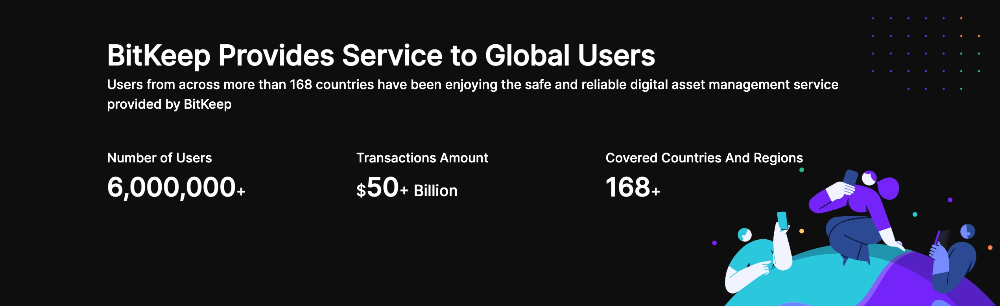

# Introduction

<!--  -->

BitKeep is a decentralized multi-chain digital wallet, dedicated to providing safe and convenient one-stop digital asset management services to users around the world. Currently, there are nearly 6 million users covering 168 countries. BitKeep has reached ecosystem partnership and strategic partnership with Top 30 pulich chains like Polygon, Solana, BSC, ETH, HECO, OEC, TRON, Fantom, Wax, IOST, AVAX, zkSync, Terra Luna , Near , Arbitrum etc. and become official recommended wallet by them. With 70+ main chains, 10,000+ DAPP and 220,000 crypto assets, aiming to provide the most convenient and easy-to-use decentralize portal to users.

<!-- Bitkeep is currently available as:
  -  [browser extension]()
  -  An iOS app
  -  An Android app -->