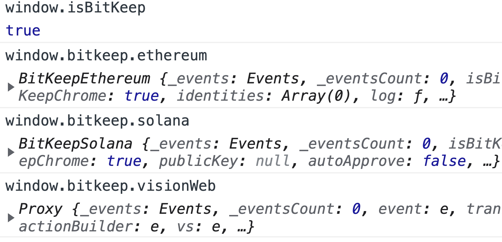

# Connect Wallet

Welcome to the developer documentation for BitKeep Wallet. The purpose of this document is to explain how to build a DApp using the BitKeep Wallent.

You can find the latest version of BitKeep Wallet on our [official website](https://bitkeep.com)

- [IOS Download](https://bitkeep.com/download?type=1)
- [Android Download](https://bitkeep.com/download?type=0)
- [Chrome Extension](https://bitkeep.com/download?type=2)

# Integrate

Once the BitKeep is installed and running (make sure to backup your Secret Recovery Phrase), you should find that the new browser tab `window.bitkeep` has an available object in the developer console. This is how your website interacts with BikKeep Wallet. This API allows websites to request users' `Ethereum Solana Tron...` accounts, read data from blockchains the user is connected to, and suggest that the user sign messages and transactions.

In order to facilitate special detection, the global object is attached with the `isBitKeep` `bitkeep` attribute.



## Quickly support bitkeep Wallet 

If the Other wallet is already available. [FAQs about BitKeep Chrome Extension](/faq.html#faqs-about-bitkeep-chrome-extension)

- `MetaMask`

>  If the MetaMask Wallet is already available. You can use the `window.bitkeep.ethereum`  as a  provider, which is the same as `window.ethereum` || `web3.currentProvider`.

- `window.solana` | `window.phantom`

>  If the solana Wallet is already available. You can use the `window.bitkeep.solana`  as a  provider, which is the same as `window.solana` and `window.phantom`.
  

- Wallet Supported by bitkeep

  | BitKeep Global Object    | support chain  |
  | ------------------------ | -------------  |
  | window.bitkeep.ethereum  |  EVM(MetaMask) |
  | window.bitkeep.solana    |  Solana        |
  | window.tronLink          |  Tron          |
  | window.bitkeep.visionWeb |  Vsision       |
  | window.bitkeep.IWalletJS |  Iost          |
  | window.bitkeep.arweave   |  Arweave       |

## Ethereum Provider API (EVM)

BitKeep injects a global API into websites visited by its users at `window?.bitkeep?.ethereum`. This API allows websites to request users' Ethereum accounts, read data from blockchains the user is connected to, and suggest that the user sign messages and transactions. The presence of the provider object indicates an Ethereum user.

### Table of Contents

- [Get Provider](#provider)
- [Basic Usage](#basic-usage)
- [Chain IDs](#chain-ids)
- Methods
  - [isConnected()](#isconnected)
  - [request(arg)](#request-args)
    - [eth_requestAccounts](#eth-requestaccounts)
    - [wallet_switchEthereumChain/wallet_addEthereumChain](#wallet-switchethereumchain-wallet-addethereumchain)
    - [eth_sendTransaction](#sendtransaction-transfer)
    - [wallet_watchAsset](#wallet-watchasset)
    - [Other API Playground](https://metamask.github.io/api-playground/api-documentation)
- Events
  - [accountsChanged/chainChanged](#event-listeners)
- [Signing Data](#signing-data)
- [Errors](#errors)
### Basic Usage

For any non-trivial Ethereum web application — a.k.a. dapp, web3 site etc. — to work, you will have to:

1. Detect the Ethereum provider (`window?.bitkeep?.ethereum`)
2.  Detect which Ethereum network the user is connected to
3. Get the user's Ethereum account(s)

reviewing the snippet in the [eth-requestaccounts](#eth-requestaccounts) to content

The provider API is all you need to create a full-featured web3 application.

You can refer a third-party base about Web3.0 login to support Bitkeep Wallet quickly, such as: [bitkeep-web3modal](https://www.npmjs.com/package/bitkeep-web3modal)[Publishing], [wagmi-demo](https://github.com/bitkeepwallet/download/tree/example/example/eth/wagmi-bitkeep-react)[Publishing].

We provide a [test-dapp](https://github.com/bitkeepwallet/example/tree/master/evm-dapp-demo/test-dapp) [Simple demo](https://github.com/bitkeepwallet/download/blob/example/example/eth/dapp/index.html). You can also use third-party libraries in conjunction with `window.bitkeep.ethereum`, [web3js](https://www.npmjs.com/package/web3) [ethers](https://www.npmjs.com/package/ethers)...


```js
//npm install bitkeep-web3modal  
// fork from https://github.com/WalletConnect/web3modal  https://github.com/WalletConnect/web3modal/issues/574
import web3modal from 'bitkeep-web3modal';
const web3Modal = new Web3Modal({
  network: 'mainnet', // optional
  cacheProvider: true, // optional
  providerOptions: {
    bitkeep: {
      package: true,
    },
    walletconnect: {
      display: {
        logo: 'data:image/gif;base64,INSERT_BASE64_STRING',
        name: 'Mobile',
        description: 'Scan qrcode with your mobile wallet',
      },
      package: WalletConnectProvider,
      options: {
        infuraId: 'INFURA_ID', // required
      },
    },
  }, // required
});

```


### Detect if BitKeep is installed

To verify if the browser is running Bitkeep, copy and paste the code snippet below in the developer console of your web browser:

```js
const isBitKeepInstalled = window.isBitKeep && !!window.bitkeep.ethereum;
 //or
const isBitKeepInstalled = window.bitkeep && window.bitkeep.ethereum
```

### Provider

```js
function getProvider() {
  const provider = window.bitkeep && window.bitkeep.ethereum;
  if (!provider) {
    window.open('https://bitkeep.com/download?type=2');
    throw "Please go to our official website to download!!"
  }
  return provider;
}
```

### Chain IDs

These are the IDs of the Ethereum chains that BitKeep supports by default. Consult [chainid.network](https://chainlist.org/zh)for more.

| Hex        | Decimal    | Network          | Hex        | Decimal    | Network          |
| ---------- | ---------- | ---------------- | ---------- | ---------- | ---------------- |
| 0x1        | 1          | Ethereum         | 0xa        | 10         | Optimism         |
| 0x18       | 24         | KardiaChain      | 0x19       | 25         | Cronos           |
| 0x38       | 56         | BNB Chain        | 0x39       | 57         | Syscoin          |
| 0x3d       | 61         | Ethereum Classic | 0x42       | 66         | OKX Chain        |
| 0x52       | 82         | Meter Mainnet    | 0x56       | 86         | GateChain        |
| 0x58       | 88         | TomoChain        | 0x64       | 100        | Gnosis Chain     |
| 0x6a       | 106        | Velas            | 0x73       | 115        | Lucky Chain      |
| 0x7a       | 122        | Fuse             | 0x80       | 128        | Heco             |
| 0x89       | 137        | Polygon          | 0xc7       | 199        | BitTorrent       |
| 0xfa       | 250        | Fantom           | 0x120      | 288        | Boba Network     |
| 0x141      | 321        | KCC              | 0x334      | 820        | Callisto Mainnet |
| 0x3e6      | 998        | Lucky Network    | 0x500      | 1280       | HALO             |
| 0x505      | 1285       | Moonriver        | 0x71a      | 1818       | CUBE             |
| 0x7e3      | 2019       | ClassZZ          | 0x868      | 2152       | Findora          |
| 0x8ae      | 2222       | Kava             | 0x1251     | 4689       | IoTeX            |
| 0x2019     | 8217       | KLAY             | 0x2710     | 10000      | smartBCH         |
| 0x4b82     | 19330      | TRUE             | 0x4ef4     | 20212      | ZSC              |
| 0x7f08     | 32520      | Bitgert          | 0xa4b1     | 42161      | Arbitrum         |
| 0xa4ec     | 42220      | Celo             | 0xa516     | 42262      | Oasis Emerald    |
| 0xa86a     | 43114      | AVAX-C           | 0x116e2    | 71394      | Nervos CKB EVM   |
| 0x335f9    | 210425     | PlatON           | 0x3e900    | 256256     | Caduceus         |
| 0xa3488    | 668808     | ASM              | 0x4e454152 | 1313161554 | Aurora           |
| 0x63564c40 | 1666600000 | Harmony          |            |            |                  | 
### isConnected()

> Note that this method has nothing to do with the user's accounts.
> You may often encounter the word "connected" in reference to whether a web3 site can access the user's accounts. In the provider interface, however, "connected" and "disconnected" refer to whether the provider can make RPC requests to the current chain.

```js
const Provider = getProvider();
Provider.isConnected();
```

### eth_requestAccounts

> **EIP-1102**
>
> This method is specified by [EIP-1102](https://eips.ethereum.org/EIPS/eip-1102). It is equivalent to the deprecated `bitkeep.ethereum.enable()` provider API method.
>
> Under the hood, it calls wallet_requestPermissions for the eth_accounts permission. Since eth_accounts is currently the only permission, this method is all you need for now.

**Returns**

`string[]` - An array of a single, hexadecimal Ethereum address string.

**Description**

Requests that the user provides an Ethereum address to be identified by. Returns a Promise that resolves to an array of a single Ethereum address string. If the user denies the request, the Promise will reject with a 4001 error.

The request causes a BitKeep popup to appear. You should only request the user's accounts in response to user action, such as a button click. You should always disable the button that caused the request to be dispatched, while the request is still pending.

If you can't retrieve the user's account(s), you should encourage the user to initiate an account request.


- `eth_accounts`    
  - Get user 
- `eth_chainId`
  - Get chainid(Hex)

```js
const Provider = getProvider();

function connect() {
  Provider.request({ method: 'eth_requestAccounts' })
    .then(handleAccountsChainChanged) // address or chainId changed
    .catch((error) => {
      if (error.code === 4001) {
        // EIP-1193 userRejectedRequest error
        console.log('Please connect to MetaMask.');
      } else {
        console.error(error);
      }
    });
}

//if used injected
const accounts = await Provider.request({ method: 'eth_requestAccounts' });

handleAccountsChainChanged(); // updated address or chainID,refer to accountsChanged/chainChanged(events)

const [address] = await Provider.request({ method: 'eth_accounts' }); // [0x1e805A9aB0FB007B4b9D44d598C6404cE292F20D]
const chainId = await Provider.request({ method: 'eth_chainId' }); // 0x1

//if used web3
import Web3 from 'web3';
const accounts = await Provider.request({ method: 'eth_requestAccounts' });
//  [0x1e805A9aB0FB007B4b9D44d598C6404cE292F20D]

const web3 = new Web3(Provider);

handleAccountsChainChanged(); // updated address or chainID, refer to accountsChanged/chainChanged(events)

const accounts = await web3.eth.getAccounts(); // [0x1e805A9aB0FB007B4b9D44d598C6404cE292F20D]
const chainId = await web3.eth.getChainId(); // 0x1
```


### request(args)

```js
  const Provider = getProvider();
  interface RequestArguments {
    method: string;
    params?: unknown[] | object;
  }
  Provider.request(args: RequestArguments): Promise<unknown>;
```


### wallet_watchAsset

> **EIP-747** 
>
> This method is specified by [EIP-747](https://eips.ethereum.org/EIPS/eip-747)


**Parameters**

  - `WatchAssetParams` - The metadata of the asset to watch.

```ts
  interface WatchAssetParams {
    type: 'ERC20'; // In the future, other standards will be supported
    options: {
      address: string; // The address of the token contract
      'symbol': string; // A ticker symbol or shorthand, up to 11 characters
      decimals: number; // The number of token decimals
      image: string; // A string url of the token logo
    };
}
```


**Returns**

`boolean` - `true` if the the token was added, `false` otherwise

**Description**

Requests that the user tracks the token in BitKeep. Returns a boolean indicating if the token was successfully added.

Most Ethereum wallets support some set of tokens, usually from a centrally curated registry of tokens. wallet_watchAsset enables web3 application developers to ask their users to track tokens in their wallets, at runtime. Once added, the token is indistinguishable from those added via legacy methods, such as a centralized registry.

```ts
  const Provider = getProvider();
  Provider
    .request({
      method: 'wallet_watchAsset',
      params: {
        type: 'ERC20',
        options: {
          address: '0xb60e8dd61c5d32be8058bb8eb970870f07233155',
          symbol: 'FOO',
          decimals: 18,
          image: 'https://foo.io/token-image.svg',
        },
      },
    })
    .then((success) => {
      if (success) {
        console.log('FOO successfully added to wallet!');
      } else {
        throw new Error('Something went wrong.');
      }
    })
    .catch(console.error);
```


### wallet_switchEthereumChain/wallet_addEthereumChain

- **wallet_addEthereumChain**

  Creates a confirmation asking the user to add the specified chain to BitKeep. The user may choose to switch to the chain once it has been added.

  **Parameters:**

  For the rpcUrls and blockExplorerUrls arrays, at least one element is required, and only the first element will be used.

  ```js
  interface AddEthereumChainParameter {
    chainId: string; // A 0x-prefixed hexadecimal string
    chainName: string;
    nativeCurrency: {
      name: string,
      symbol: string, // 2-6 characters long
      decimals: 18,
    };
    rpcUrls: string[];
    blockExplorerUrls?: string[];
    iconUrls?: string[]; // Currently ignored.
  }
  ```

  **Returns**

  null - The method returns null if the request was successful, and an error otherwise.

  **Usage with wallet_switchEthereumChain**

  We recommend using this method with wallet_addEthereumChain:

  ```js
  const Provider = getProvider();
  try {
    await Provider.request({
      method: 'wallet_switchEthereumChain',
      params: [{ chainId: '0xf00' }],
    });
  } catch (switchError) {
    // This error code indicates that the chain has not been added to Bitkeep.
    if (switchError.code === 4902) {
      try {
        await ethereum.request({
          method: 'wallet_addEthereumChain',
          params: [
            {
              chainId: '0xf00',
              chainName: '...',
              rpcUrls: ['https://...'] /* ... */,
            },
          ],
        });
      } catch (addError) {
        // handle "add" error
      }
    }
    // handle other "switch" errors
  }
  ```

- **wallet_switchEthereumChain**

  Creates a confirmation asking the user to switch to the chain with the specified chainId.

  **Parameters:**

  For the rpcUrls and blockExplorerUrls arrays, at least one element is required, and only the first element will be used.

  ```js
  interface SwitchEthereumChainParameter {
    chainId: string; // A 0x-prefixed hexadecimal string
  }
  ```

  **Returns**

  null - The method returns null if the request was successful, and an error otherwise.

  If the error code (`error.code`) is `4902`, then the requested chain has not been added by BitKeep, and you have to request to add it via `wallet_addEthereumChain`.

  **Description**

  As with any method that causes a confirmation to appear, `wallet_switchEthereumChain` should only be called as a result of direct user action, such as the click of a button.

  Bitkeep will automatically reject the request under the following circumstances:

  - If the chain ID is malformed
  - If the chain with the specified chain ID has not been added to BitKeep


### Ethereum JSON-RPC Methods

For the Ethereum JSON-RPC API, please see the [Ethereum wiki](https://ethereum.org/en/developers/docs/apis/json-rpc/#json-rpc-methods).
How to use reference to  [API Playground](https://metamask.github.io/api-playground/api-documentation).

- [eth_accounts](https://ethereum.org/en/developers/docs/apis/json-rpc/#eth_accounts) 
- [eth_call](https://ethereum.org/en/developers/docs/apis/json-rpc/#eth_accounts)
- [eth_getBalance](https://ethereum.org/en/developers/docs/apis/json-rpc/#eth_getbalance)
- [eth_sendTransaction](https://ethereum.org/en/developers/docs/apis/json-rpc/#eth_sendtransaction)
- [eth_sign](https://ethereum.org/en/developers/docs/apis/json-rpc/#eth_sign)


```ts

  const Provider = getProvider();

  await Provider.request({method:"eth_accounts", params:[]})
  await Provider.request({method:"eth_getBalance", params:[]})

```

### Event listeners

Notify when address and network changed . used [eventemitter3](https://www.npmjs.com/package/eventemitter3)

```js
const Provider = getProvider();
// reomove all listeners
Provider.removeAllListeners();

function handleAccountsChainChanged() {
  Provider.on('accountsChanged', ([address]) => {
    // Handle the new accounts, or lack thereof.
    // "accounts" will always be an array, but it can be empty.
    alert('address changed');
  });
  Provider.on('chainChanged', async (chainId) => {
    // Handle the new chain.
    // Correctly handling chain changes can be complicated.
    // We recommend reloading the page unless you have good reason not to.
    alert('chainid changed');
  });
}
```

Also, don't forget to remove listeners once you are done listening to them (for example on component unmount in React).
Prevent multiple listening, and clear it before listening `removeAllListeners`.

```js
const Provider = getProvider();
function handleAccountsChanged(accounts) {
  // ...
}
Provider.on('accountsChanged', handleAccountsChanged);

//remove
Provider.removeAllListeners(); //remove all
Provider.removeListener('accountsChanged', handleAccountsChanged); // only remove accountsChanged
```

**accountsChanged**

The BitKeep provider emits this event whenever the return value of the eth_accounts RPC method changes. eth_accounts returns an array that is either empty or contains a single account address. The returned address, if any, is the address of the most recently used account that the caller is permitted to access. Callers are identified by their URL origin, which means that all sites with the same origin share the same permissions.

This means that accountsChanged will be emitted whenever the user's exposed account address changes.

```ts
  const Provider = getProvider();
  Provider.on('accountsChanged', handler: (accounts: Array<string>) => void);
```

**chainChanged**
The BitKeep provider emits this event when the currently connected chain changes.

All RPC requests are submitted to the currently connected chain. Therefore, it's critical to keep track of the current chain ID by listening for this event.

We strongly recommend reloading the page on chain changes, unless you have good reason not to.

```ts
  const Provider = getProvider();
  Provider.on('accountsChanged', handler: (accounts: Array<string>) => void);
```

### Errors

All errors thrown or returned by the MetaMask provider follow this interface:

```ts
interface ProviderRpcError extends Error {
  message: string;
  code: number;
  data?: unknown;
}
```

The ethereum.request(args) method throws errors eagerly. You can often use the error code property to determine why the request failed. Common codes and their meaning include:

- `4001`
  - The request was rejected by the user
- `-32603`
  - Internal error or The parameters were invalid

### Signing Data

  - `eth_sign`
  - `personal_sign`   
  - `eth_signTypedData`
  - `eth_signTypedData_v3`
  - `eth_signTypedData_v4`
  
  You can refer to  docs
  - [signing-data-with-metamask](https://docs.metamask.io/guide/signing-data.html#signing-data-with-metamask)
  - [eth-sig-util](https://github.com/MetaMask/eth-sig-util).
  - [demo](https://github.com/MetaMask/test-dapp)
### sendTransaction(Transfer)

```js
const Provider = getProvider();
const transactionParameters = {
  nonce: '0x00', // ignored by Bitkeep
  gasPrice: '0x09184e72a000', // customizable by user during Bitkeep confirmation.
  gas: '0x2710', // customizable by user during Bitkeep confirmation.
  to: '0x0000000000000000000000000000000000000000', // Required except during contract publications.
  from: Provider.selectedAddress, // must match user's active address.
  value: '0x00', // Only required to send ether to the recipient from the initiating external account.
  data:
    '0x7f7465737432000000000000000000000000000000000000000000000000000000600057', // Optional, but used for defining smart contract creation and interaction.
  chainId: '0x3', // Used to prevent transaction reuse across blockchains. Auto-filled by Bitkeep.
};

// txHash is a hex string
// As with any RPC call, it may throw an error
const txHash = await Provider.request({
  method: 'eth_sendTransaction',
  params: [transactionParameters],
});

// if used web3
const accounts = await Provider.request({ method: 'eth_requestAccounts' });
const web3 = new Web3(Provider);
const result = await web3.eth.sendTransaction({
  from: Provider.selectedAddress,
  to: '0x0000000000000000000000000000000000000000',
  value: web3.utils.toWei('1', 'ether'),
});
```
## Tron

We provide [Simple demo](https://github.com/bitkeepwallet/download/tree/example/example/tron/dapp) and are compatible with [tronlink dapp](https://developers.tron.network/docs/dapp-integrate-with-tronlink-introduction).

### isInstalled

```js
const isBitKeepInstalled = window.tronLink && window.isBitKeep;
```

### eth_requestAccounts(request authorization to connect)

```js
try {
  await tronLink.request({ method: 'tron_requestAccounts' });
  const address = tronWeb.defaultAddress.base58;
  const balance = await tronWeb.trx.getBalance(address);
} catch {}
```

### connected

```js
  window.tronWeb.ready;
```

### sendTransaction(Transfer)

```js
var tronweb = window.tronWeb;
var tx = await tronweb.transactionBuilder.sendTrx(
  'TW8u1VSwbXY7o7H9kC8HmCNTiSXvD69Uiw',
  1000000,
  tronWeb.defaultAddress.base58
);
var signedTx = await tronweb.trx.sign(tx);
var broastTx = await tronweb.trx.sendRawTransaction(signedTx);
console.log(broastTx);
console.log(broastTx.txid);

//Token
let decimal = 18;
let Contract = await tronWeb
  .contract()
  .at('TLa2f6VPqDgRE67v1736s7bJ8Ray5wYjU7'); //WIN
const decimalCall = Contract.decimals || Contract.DECIMALS;
if (decimalCall) {
  decimal = await decimalCall().call();
}
let broastTx = await Contract.transfer(
  'TW8u1VSwbXY7o7H9kC8HmCNTiSXvD69Uiw',
  // "0xde0b6b3a7640000"
  tronWeb.toHex(2 * Math.pow(10, decimal))
)
  .send
  // {
  //     feeLimit: 10000000
  // }
  ();
console.log(broastTx);
```

## solana

We provide a [Simple demo](https://github.com/bitkeepwallet/download/tree/example/example/solana/dapp), and you can also refer to [solana-web3](https://solana-labs.github.io/solana-web3.js/)

Quickly support bitkeep Wallet If the Other wallet is already available.

- MathWallet

  If the MathWallet Wallet is already available. You can replace `window.solana` with `window.bitkeep.solana` as a provider.

### IsInstalled

```js
const isBitKeepInstalled = window.isBitKeep && window.bitkeep.solana;
```

### Provider

```js
function getProvider() {
  const provider = window.bitkeep && window.bitkeep.solana;
  if (!provider) {
    window.open('https://bitkeep.com/download?type=2');
    throw  `Please guide users to download from our official website`
  }
  return provider;
}
```

### connect(request authorization to connect)

```js
try {
  await window.bitkeep.solana.connect();
  const publicKey = await window.bitkeep.solana.getAccount();
  window.bitkeep.solana.publicKey.toString(); // Once the web application is connected to Bitkeep,
} catch {
  alert('connected error');
}
```

### connected

```js
window.bitkeep.solana.connected;
const publicKey = await window.bitkeep.solana.getAccount();
window.bitkeep.solana.publicKey.toString(); // Once the web application is connected to Bitkeep
```

### signMessage

```js
//string
window.bitkeep.solana.signMessage(
  '020006106e655af38ff7324bbf1d4e16b06084763269b9'
);

// uint8Array
const message = `You can use uint8array to verify`;
const encodedMessage = new TextEncoder().encode(message);
const signedMessage = await window.bitkeep.solana.signMessage(encodedMessage);
const nacl = require('tweetnacl');
const { PublicKey } = require('@solana/web3.js');
// nacl.sign.detached.verify(encodedMessage, signedMessage, publicKey)
nacl.sign.detached.verify(
  encodedMessage,
  signedMessage,
  new PublicKey(address).toBytes()
);
```

### Event listeners

used [eventemitter3](https://www.npmjs.com/package/eventemitter3)

```js
window.bitkeep.solana.on('connect', () => console.log('connected!'));
```

### sendTransaction

You can refer to the following demo :
[simple demo](https://github.com/bitkeepwallet/download/blob/example/example/solana/dapp/index.html)
[web3 demo](https://github.com/solana-labs/solana/tree/master/web3.js/examples)
[Token demo](https://github.com/solana-labs/solana-program-library/tree/master/token/js/examples)

## Terra

You can refer to the following [simple demo](https://github.com/terra-money/wallet-provider/tree/main/templates)

## WalletConnect

### EVM(WebApp)

WalletConnect is an open protocol for connecting wallets and DApps (Web3 applications), which uses a bridge server to establish a remote connection between two applications and/or devices, scan a QR code to establish a connection and start communication. BitKeep Wallet App now supports WalletConnect。

For more detailed document, please refer to the [https://docs.walletconnect.com](https://docs.walletconnect.com)

- [react-app.walletconnect.com/)](https://react-app.walletconnect.com/)
- [Web3 Provider](https://docs.walletconnect.com/quick-start/dapps/web3-provider)
- [Standalone Client](https://docs.walletconnect.com/quick-start/dapps/client)
- [example](https://github.com/WalletConnect/web-examples)

we provide a [simple demo](https://github.com/bitkeepwallet/download/tree/example/example/walletConnect)

    npm install --save @walletconnect/client @walletconnect/qrcode-modal

```js
import WalletConnect from '@walletconnect/client';
import QRCodeModal from '@walletconnect/qrcode-modal';

// Create a connector
const connector = new WalletConnect({
  bridge: 'https://bridge.walletconnect.org', // Required
  qrcodeModal: QRCodeModal,
});

// Check if connection is already established
if (!connector.connected) {
  // create new session
  connector.createSession();
}

// Subscribe to connection events
connector.on('connect', (error, payload) => {
  if (error) {
    throw error;
  }

  // Get provided accounts and chainId
  const { accounts, chainId } = payload.params[0];
});

connector.on('session_update', (error, payload) => {
  if (error) {
    throw error;
  }

  // Get updated accounts and chainId
  const { accounts, chainId } = payload.params[0];
});

connector.on('disconnect', (error, payload) => {
  if (error) {
    throw error;
  }

  // Delete connector
});
```

### EVM(Native App SDK)

Please refer to the [WalletConnect Doc](https://docs.walletconnect.com/quick-start) and follow to find the docking documentation of your current program

## Bitkeep(Chrome extension swap)

> <font color='#fdd000'>Only BitKeep Chrome extension is supported for the time being</font>

> <font color='#fdd000'>If you send an unsupported mainnet, an error will be prompted</font>

- ### window.bitkeep.navigateTo

  invoke swap， Support Mainnet can refer to [support mainnet](/swapchainList.json).

  ```javascript
  window.bitkeep.navigateTo('swap', {
      chain: "eth"
      fromCoin: {
          chain: 'eth',
          chainName: 'Ethereum',
          contract: '0xdac17f958d2ee523a2206206994597c13d831ec7',
          icon: 'https://cdn.bitkeep.vip/coins/u/usdt_eth.png',
          symbol: 'USDT',
      },
      toCoin: {
          chain: 'eth',
          chainName: 'Ethereum',
          icon: 'https://cdn.bitkeep.vip/u_b_bae388c0-9afd-11ec-aac8-bf8a172584ab.png',
          symbol: 'ETH',
      },
  });

  ```

  ### params

  | key      | type   | require | default                         | description                                                     |
  | -------- | ------ | ------- | ------------------------------- | --------------------------------------------------------------- |
  | fromCoin | object | false   | Current Mainnet Token           | Token to be swap. Refer to the following table for details      |
  | toCoin   | object | false   | Current Mainnet Token usdt/usdc | Token to be converted. Refer to the following table for details |

  | fromCoin/toCoin | type   | require | value                                                                | description                                                           |
  | --------------- | ------ | ------- | -------------------------------------------------------------------- | --------------------------------------------------------------------- |
  | chain           | string | true    | eth                                                                  | "eth" =="Ethereum" Mainnet name [reference json](/swapchainList.json) |
  | chainName       | string | false   | Ethereum                                                             | Mainnet name                                                          |
  | contract        | string | false   | contract address                                                     | token contract address                                                |
  | icon            | string | true    | http://cdn.bitkeep.vip/u_b_81d12c10-146e-11ec-9c06-1d0c5ac6bcb6.jpeg | token icon                                                            |
  | symbol          | string | true    | usdt                                                                 | token name                                                            |

## Used Open source library

If you use open source code and need us to support push open source code, please [Contact us](https://bitkeep.com/about#Contact_us)。

https://github.com/bitkeepwallet/web3-react

